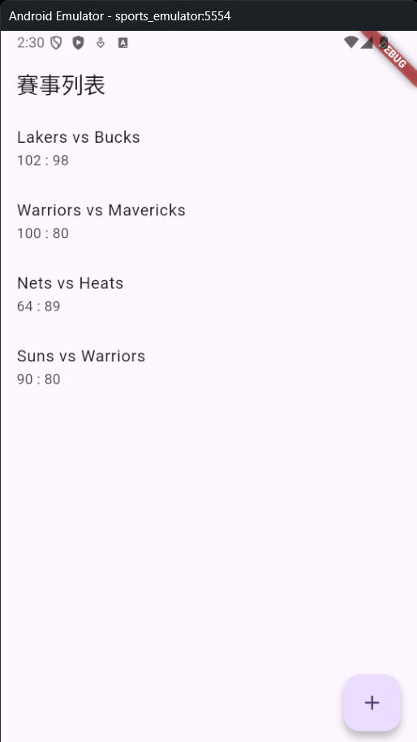
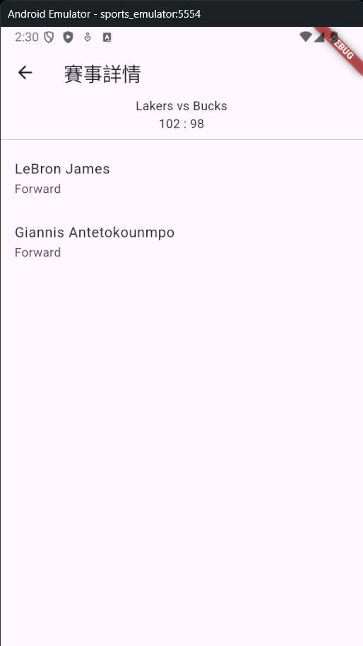
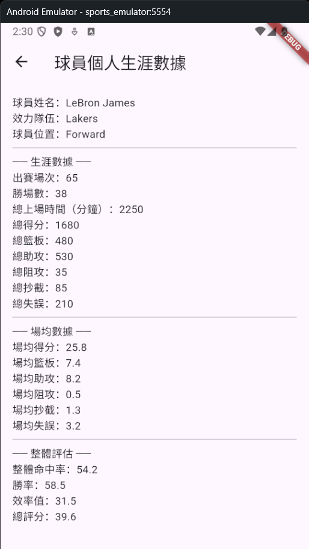
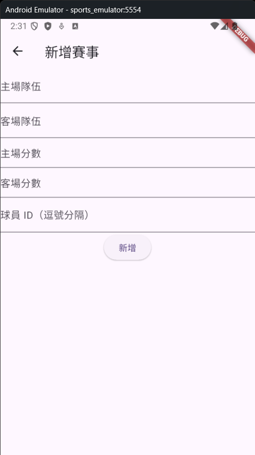
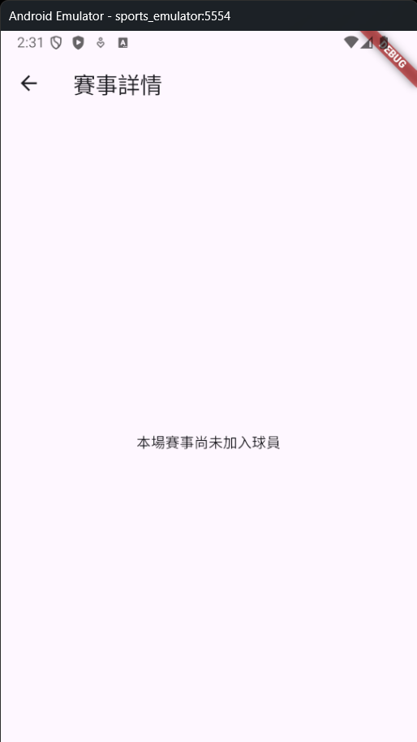

# 🏆 Sports App

A Flutter mobile application for managing sports matches and player statistics, built with Clean Architecture and BLoC state management.

---

## 技術棧 Tech Stack

| 類別                 | 技術                               |
| -------------------- | ---------------------------------- |
| Framework            | Flutter (Dart)                     |
| Architecture         | Clean Architecture · Feature-first |
| State Management     | flutter_bloc                       |
| Dependency Injection | get_it                             |
| Database             | Firebase Firestore                 |
| Version Control      | GitHub Flow                        |

---

## 專案架構 Architecture

本專案採用 **Clean Architecture** 搭配 **Feature-first** 資料夾組織。

### 核心原則

依賴方向只能由外往內，`domain` 層為核心，不依賴任何外部框架：

```
presentation  ──→  domain  ←──  data
   (BLoC)        (純 Dart)    (Firestore)
```

- `presentation`：呼叫 domain 的 UseCase，負責 UI 與狀態管理
- `domain`：定義 Entity、UseCase、Repository interface，無任何外部依賴
- `data`：實作 Repository interface，負責與 Firebase 溝通

### Feature 區分方式

以**功能模組（functional domain）** 為單位區分，目前包含兩個 feature：

| Feature  | 說明                                       |
| -------- | ------------------------------------------ |
| `match`  | 賽事列表、新增賽事、賽事詳情（含上場球員） |
| `player` | 球員列表、個人頁面、數據統計與評估         |

每個 feature 各自獨立，包含完整的 data / domain / presentation 三層，修改其中一個不影響另一個。

---

## 資料夾結構 Folder Structure

```
lib/
├── core/
│   ├── error/
│   │   └── failure.dart
│   ├── usecases/
│   │   └── usecase.dart
│   └── injection_container.dart   # GetIt 所有依賴登記
│
├── features/
│   ├── match/
│   │   ├── data/
│   │   │   ├── datasources/
│   │   │   │   └── match_remote_datasource.dart
│   │   │   ├── models/
│   │   │   │   └── match_model.dart
│   │   │   └── repositories/
│   │   │       └── match_repository_impl.dart
│   │   ├── domain/
│   │   │   ├── entities/
│   │   │   │   └── match.dart
│   │   │   ├── repositories/
│   │   │   │   └── match_repository.dart
│   │   │   └── usecases/
│   │   │       ├── get_matches.dart
│   │   │       ├── add_match.dart
│   │   │       └── get_match_players.dart
│   │   └── presentation/
│   │       ├── bloc/
│   │       │   ├── match_bloc.dart
│   │       │   ├── match_event.dart
│   │       │   └── match_state.dart
│   │       └── pages/
│   │           ├── match_list_page.dart
│   │           ├── match_detail_page.dart
│   │           └── add_match_page.dart
│   │
│   └── player/
│       ├── data/
│       │   ├── datasources/
│       │   │   └── player_remote_datasource.dart
│       │   ├── models/
│       │   │   └── player_model.dart
│       │   └── repositories/
│       │       └── player_repository_impl.dart
│       ├── domain/
│       │   ├── entities/
│       │   │   └── player.dart
│       │   ├── repositories/
│       │   │   └── player_repository.dart
│       │   └── usecases/
│       │       ├── get_player.dart
│       │       ├── get_player_stats.dart
│       │       └── evaluate_player.dart
│       └── presentation/
│           ├── bloc/
│           │   ├── player_bloc.dart
│           │   ├── player_event.dart
│           │   └── player_state.dart
│           └── pages/
│               ├── player_list_page.dart
│               └── player_profile_page.dart
│
└── main.dart
```

---

## 功能說明 Features

### 賽事管理 Match Management

- 瀏覽所有賽事列表
- 新增賽事（對戰隊伍、比分、球員 ID）
- 點擊賽事進入詳情頁，顯示上場球員列表
- 資料即時同步至 Firebase Firestore

### 球員管理 Player Management

- 瀏覽球員列表
- 球員個人頁面（基本資料、生涯數據）
- 場均數據統計（得分、籃板、助攻、抄截、阻攻）
- 綜合表現評估（命中率、勝率、效率值、總評分）
- 從賽事詳情頁點擊球員可直接進入個人頁面

---

## 截圖 Screenshots

| 賽事列表                                       | 賽事詳情                                         | 球員個人數據                                           |
| ---------------------------------------------- | ------------------------------------------------ | ------------------------------------------------------ |
|  |  |  |

| 新增賽事                                      | 空白狀態                                               |
| --------------------------------------------- | ------------------------------------------------------ |
|  |  |

---

## 如何執行 Getting Started

### 環境需求

- Flutter SDK `>=3.0.0`
- Dart SDK `>=3.0.0`
- Firebase 專案（Firestore 已啟用）

### 安裝步驟

1. Clone 此 repo：

```bash
git clone https://github.com/erich0526/sports_app.git
cd sports_app
```

2. 安裝套件：

```bash
flutter pub get
```

3. 設定 Firebase：

```bash
dart pub global activate flutterfire_cli
flutterfire configure
```

4. 執行 App：

```bash
flutter run
```

---

## 開發流程 GitHub Flow

本專案遵循 **GitHub Flow**：

```
main（永遠可執行）
  ├── feature/match-domain-data
  ├── feature/match-presentation
  ├── feature/player-domain
  ├── feature/player-data
  ├── feature/player-pages
  └── feature/match-detail-page
```

- `main` branch 永遠保持可正常執行的狀態
- 每個功能在獨立的 feature branch 開發
- 完成後開 Pull Request，review 通過後 merge 回 main
- Commit message 遵循 [Conventional Commits](https://www.conventionalcommits.org/)

### Commit Message 格式

```
feat(match): add GetMatches use case and Firestore implementation
fix(player): correct stats calculation for empty match list
refactor(core): extract BaseUseCase to reduce boilerplate
docs(readme): update folder structure section
```

---

## 依賴套件 Dependencies

```yaml
dependencies:
  flutter_bloc: ^9.1.1
  get_it: ^9.2.1
  firebase_core: ^4.10.0
  cloud_firestore: ^6.5.0
  equatable: ^2.0.5
```

---

## License

MIT
